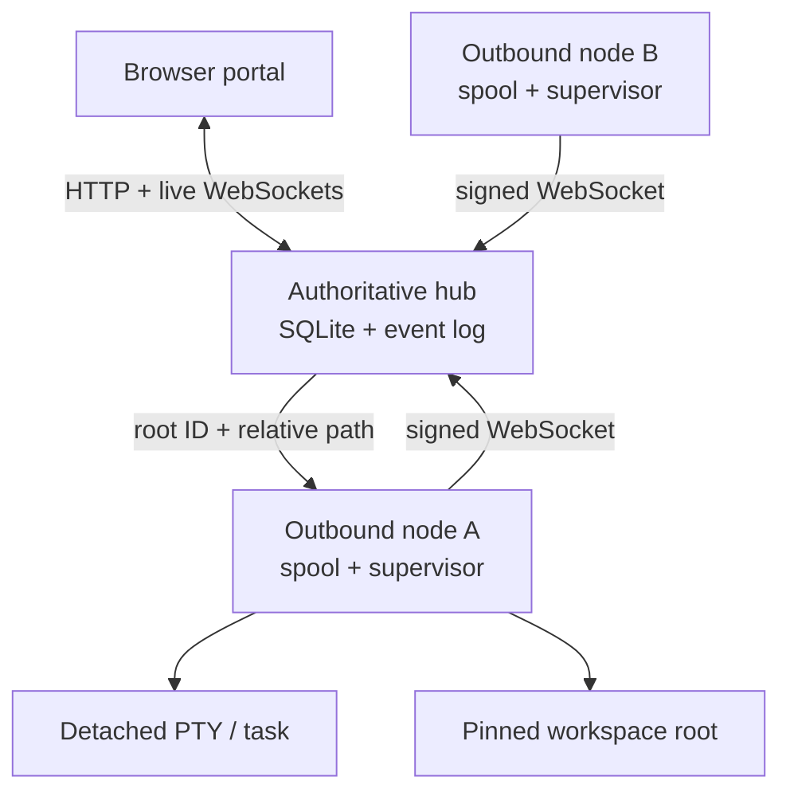

# WebSpider Fabric

WebSpider Fabric is a working vertical-slice implementation of the distributed persistent-agent orchestrator described in the [product specification](docs/SPECIFICATION.md). It runs an authoritative hub, outbound-connected worker nodes, a durable browser portal, root-confined files, detached terminal processes, messages, tasks, artifacts, events, leases, role-aware project agreements, and audit history.

The primary interaction principle is that the user steers outcomes while WebSpider and its agents resolve routine detail. A normal local project does not begin with a setup questionnaire: WebSpider inspects bounded workspace signals, applies academic-first safe defaults, finds Codex on `PATH` when available, and opens on the most recently active project conversation.

User distributions are versioned GitHub Release assets built on native GitHub-hosted runners. Each platform installer contains its own runtime; Node.js is an internal implementation detail, not a prerequisite the user installs or manages. Generated binaries are not committed to the source tree. The specification's final architecture calls for Go 1.24, `os.Root`, React, xterm.js, ACP, and tmux; current substitutions are tracked in [Implementation status](docs/IMPLEMENTATION_STATUS.md).

## Quick start

The release bootstrap detects the machine, downloads the matching immutable release asset from `MurrellGroup/WebSpider`, verifies it against `SHA256SUMS`, installs the native per-user boot service, and starts WebSpider. Because the repository is private, use an authenticated GitHub CLI to obtain the bootstrap and export a token with read access for its two authenticated asset downloads:

```bash
export GH_TOKEN="$(gh auth token)"
gh release download --repo MurrellGroup/WebSpider --pattern WebSpider_Install.run --clobber
sh WebSpider_Install.run --workspace "$PWD"
```

The bootstrap inherits `GH_TOKEN` and uses GitHub's authenticated release-asset API for the versioned installer and checksum downloads. If the repository is later made public, the bootstrap can instead be downloaded from `https://github.com/MurrellGroup/WebSpider/releases/latest/download/WebSpider_Install.run` and run without a token.

The same release also contains fully self-contained installers for direct or offline use:

| Machine | Release asset |
| --- | --- |
| Linux x86-64 | `WebSpider_Install_0.4.1_linux_x64.run` |
| Linux ARM64 | `WebSpider_Install_0.4.1_linux_arm64.run` |
| macOS Intel | `WebSpider_Install_0.4.1_macos_x64.run` |
| macOS Apple silicon | `WebSpider_Install_0.4.1_macos_arm64.run` |

Run the downloaded asset directly through the system shell:

```bash
sh ~/Downloads/WebSpider_Install_0.4.1_linux_x64.run --workspace /path/to/project
```

No separate runtime or package-manager setup is part of either user workflow.

Open `http://127.0.0.1:7340`. Closing the browser does not stop the managed agent or detached tasks.

For source development only, contributors can run the repository with Node.js 24:

```bash
node ./bin/webspider.js up --workspace .
```

If Codex is installed on `PATH`, `webspider up` selects it automatically. Otherwise it starts the compatibility shell. An unusual executable can be selected explicitly without defining a full agent profile:

```bash
node ./bin/webspider.js up --workspace . \
  --agent-command /path/to/agent \
  --agent-args='["--example-option"]'
```

Run verification:

```bash
node --test --test-concurrency=1
node ./bin/webspider.js doctor
```

## Release engineering

The repository owns the build recipe; GitHub Releases own the binaries. `.github/workflows/ci-release.yml` tests and builds these native targets independently:

- `linux-x64` on `ubuntu-24.04`;
- `linux-arm64` on `ubuntu-24.04-arm`;
- `darwin-x64` on `macos-15-intel`;
- `darwin-arm64` on `macos-15`.

Pull requests, `main` pushes, and manual runs produce short-lived Actions artifacts after a clean-install smoke test. A semantic version tag such as `v0.4.1` additionally:

1. requires the tag to equal the version in `package.json`;
2. gathers exactly four native installers;
3. renders the platform-selecting `WebSpider_Install.run` bootstrap;
4. generates `SHA256SUMS`;
5. creates the matching GitHub Release and attaches those six files.

Create a release by pushing its annotated tag:

```bash
git tag -a v0.4.1 -m "WebSpider 0.4.1"
git push origin v0.4.1
```

For a native development build on the current machine:

```bash
npm run build:installer
```

That command writes a generated, Git-ignored platform installer under `dist/`. It refuses to label a runtime as a different OS or architecture.

## Add another worker

On the hub machine:

```bash
node ./bin/webspider.js token create \
  --hub http://127.0.0.1:7340 \
  --owner-token "$WEBSPIDER_OWNER_TOKEN" \
  --name gpu-box
```

On the worker:

```bash
node ./bin/webspider.js node join \
  --hub https://webspider.example-tailnet.ts.net \
  --token wsj_... \
  --root awr_gpu=/data/project

node ./bin/webspider.js node
```

The join token is stored hashed, expires after ten minutes by default, and is consumed atomically. The node generates an Ed25519 identity locally and thereafter authenticates each outbound connection with a signed, replay-bounded challenge payload. A monotonically increasing connection epoch fences stale connections.

## Architecture



The hub owns projects, nodes, profiles, agent instances, threads, messages, deliveries, tasks, attempts, roots, terminal leases, artifacts, attention items, events, outbox records, sessions, and audit history. Nodes own host paths, process supervision, root-safe file opens, terminal logs, received-command deduplication, and unsent event spools.

## Operational behavior

- `webspider up` bootstraps a local project, primary agent, logical thread, terminal, workspace root, and default project agreement.
- Academic-project context is inferred from bounded workspace signals such as manuscript, bibliography, Quarto, LaTeX, notebook, results, and figure assets. When signals are sparse, the academic-first default remains usable without requiring answers.
- Every agent launch receives a versioned immutable, role-aware policy snapshot. Codex launches receive a managed `CODEX_HOME` that preserves existing user-level guidance and configuration while adding the compiled WebSpider instructions through native `AGENTS.md` discovery.
- The main agent owns low-burden orchestration and integration. Remote workers receive only their task boundary and result-critical invariants; their native harness remains authoritative for planning, tools, execution, and reporting.
- When the user explicitly asks to change behavior or defaults, the main agent can inspect and patch project- or system-level policy through a scoped helper. Revisions are optimistic, changes are audited, and independent WebSpider workers receive no control credential. Harness-native child threads are explicitly de-scoped from the main-only agreement.
- The main agent treats session context and account allowance as different budgets. It uses `/status` at natural breakpoints for context and the reported weekly rate-limit percentage; `/usage weekly` is optional supporting token activity, never a substitute for percent remaining. Read-only observations are timestamped and shown in later inbound envelopes and the portal.
- Account management is always human-only. Agents cannot redeem token refreshes or rate-limit resets, buy/add/switch credits, change billing, plan, or authentication, move work to API-funded usage, or request entitlements—even if a provider surface happens to expose those actions.
- The portal defaults to the active conversation, reduces routine sending to one decision, and keeps delivery timing, process controls, policy detail, and operational metadata behind progressive disclosure.
- Conversations, Markdown-family files, and the terminal's Readable view render sanitized Markdown and browser-native MathML. Raw terminal text remains available beside it and remains the source of truth.
- Managed commands use an isolated native PTY bridge (`script` on Linux and `expect` on macOS), named input FIFO, detached process group, append-only terminal log, and atomic exit-status marker.
- A node restart reconciles persisted process IDs, log offsets, FIFOs, and exit markers. A hub outage does not terminate a detached process.
- Every node reconnect reports its reconciled runtime inventory. Previously-running agents missing after a machine reboot are restarted according to policy, receive a bounded copy of their prior terminal context, and get a durable recovery message instructing them to continue without requiring the user to restate the project.
- Browser event clients replay from a durable global sequence before receiving live events.
- Any number of terminal viewers may watch; only a valid, current lease holder can send input.
- Messages are accepted transactionally before dispatch and use immutable idempotency keys.
- File APIs accept only `(root_id, relative_path)`. Host paths never cross the browser API.
- Promoted artifacts are content-addressed by SHA-256 and remain independent of the workspace file.

## Security defaults

- Hub listens on `127.0.0.1` by default. Put Tailscale Serve or another trusted HTTPS proxy in front of it; do not expose it directly to the public internet.
- Browser authentication uses a Secure-capable, HttpOnly, SameSite session cookie; mutations require a separate CSRF token.
- WebSocket upgrades require an authenticated session and strict same-origin validation.
- Portal assets use a restrictive CSP and no third-party CDN code.
- Active project HTML, SVG, and JavaScript are download-only, never rendered as same-origin content.
- Roots pin their initial filesystem identity. Strict mode blocks all symlinks; contained mode verifies the opened target remains under the pinned root. Special files are never previewed or downloaded.
- Raw terminal bytes render through `textContent`; the optional readable representation strips terminal control sequences and passes only escaped Markdown, safe links, and generated MathML through the renderer. Terminal input remains size- and control-character-bounded.
- Audit records preserve the actual actor separately from the role delivered to an agent.
- Main-agent control tokens are short-lived, revocable, and allowlisted to policy edits plus account-usage observation records. They cannot authorize ordinary project, file, message, task, artifact, terminal, administrative, billing, reset, credit, authentication, or funding APIs.

See [Security model](docs/SECURITY.md) for details and limitations.

## Repository map

```text
bin/webspider.js             executable entry point
src/hub/                     HTTP API, auth, broker, event and runtime coordination
src/node/                    outbound daemon, rooted files, detached supervisor
src/db/                      hub and node SQLite schemas
src/transport/               bounded WebSocket implementation
src/lib/                     IDs, routing, HTTP, errors, cryptography
web/                         responsive browser portal and PWA manifest
test/                        persistence, security, runtime, and integration tests
docs/                        implementation and security notes
examples/                    API/configuration examples
install/                     single-file installer and installed-command launcher
scripts/                     native installer and release-bootstrap builders
.github/workflows/           native CI matrix and tag-to-Release publication
dist/                        generated local output (Git-ignored)
```

The completed cognitive-overhead audit and the product invariants it establishes are recorded in [User-burden audit](docs/USER_BURDEN_AUDIT.md). The main/worker authority split, sparse instruction compiler, and editable-default workflow are specified in [Behavior control and agent autonomy](docs/BEHAVIOR_CONTROL.md).

## Tailscale deployment

Keep the hub on loopback and publish it privately:

```bash
tailscale serve --bg http://127.0.0.1:7340
```

Set the advertised URL when starting the hub:

```bash
node ./bin/webspider.js hub \
  --listen 127.0.0.1:7340 \
  --public-base-url https://webspider.example-tailnet.ts.net
```

Tailscale reachability is not authorization: every browser session, WebSocket, root operation, terminal lease, and node command is still checked by WebSpider.
