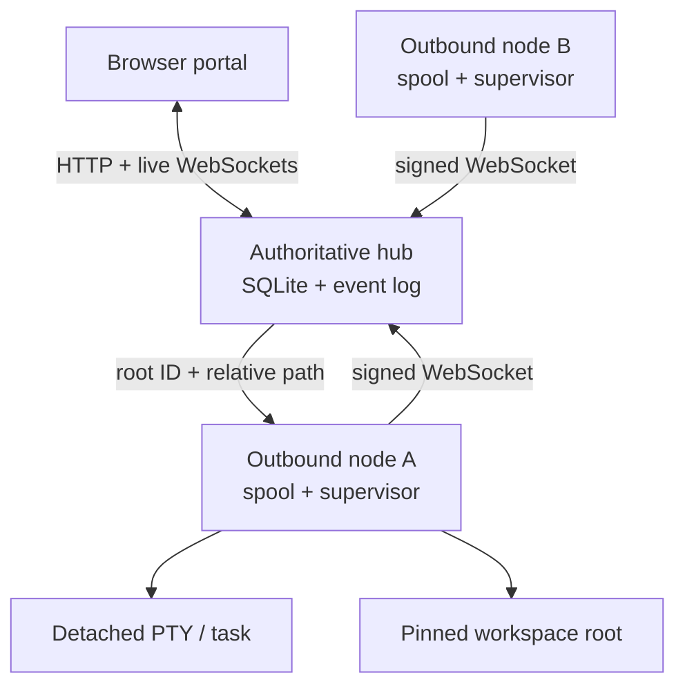

# WebSpider Fabric

WebSpider Fabric is a persistent research-portfolio orchestrator. One master Codex coordinates projects and durable worker Codex sessions across multiple machines: it can review every project's state, send detailed work to a project worker, receive progress and blocker reports, and follow up without requiring the user to supervise each terminal. The browser portal remains the user's control room and survives browser, hub, and worker reconnects.

The primary interaction is the master's persistent browser terminal. WebSpider starts the user's login shell inside a detached PTY; run `codex` there exactly as in a local `screen` session. Each project worker is also a real persistent Codex terminal that the user can open and steer directly. Extra shell tabs under any agent provide screen-like monitoring terminals for `nvidia-smi`, logs, and other tools without becoming orchestration message targets.

User distributions are versioned GitHub Release assets built on native GitHub-hosted runners. Each platform installer contains its own runtime; Node.js is an internal implementation detail, not a prerequisite the user installs or manages. Generated binaries are not committed to the source tree. The specification's final architecture calls for Go 1.24, `os.Root`, React, xterm.js, ACP, and tmux; current substitutions are tracked in [Implementation status](docs/IMPLEMENTATION_STATUS.md).

## Quick start

The release bootstrap detects the machine, downloads the matching immutable release asset from `MurrellGroup/WebSpider`, verifies it against `SHA256SUMS`, installs the native per-user boot service, and starts WebSpider:

```bash
i=$(mktemp);curl --http1.1 -fL --retry 5 -o "$i" https://github.com/MurrellGroup/WebSpider/releases/latest/download/WebSpider_Install.run&&sh "$i" --workspace "$PWD"
```

The same release also contains fully self-contained installers for direct or offline use:

| Machine | Release asset |
| --- | --- |
| Linux x86-64 | `WebSpider_Install_0.5.0_linux_x64.run` |
| Linux ARM64 | `WebSpider_Install_0.5.0_linux_arm64.run` |
| macOS Intel | `WebSpider_Install_0.5.0_macos_x64.run` |
| macOS Apple silicon | `WebSpider_Install_0.5.0_macos_arm64.run` |

Run the downloaded asset directly through the system shell:

```bash
sh ~/Downloads/WebSpider_Install_0.5.0_linux_x64.run --workspace /path/to/project
```

No separate runtime or package-manager setup is part of either user workflow.

Open `http://127.0.0.1:7340`. Closing the browser does not stop the managed agent or detached tasks.

### Remote server

On a trusted private network or VPN, bind the persistent service to the server's private address. A Tailscale address is preferable to `0.0.0.0` because WebSpider will then be reachable only through the tailnet:

```bash
i=$(mktemp);curl --http1.1 -fL --retry 5 -o "$i" https://github.com/MurrellGroup/WebSpider/releases/latest/download/WebSpider_Install.run&&sh "$i" --listen "$(tailscale ip -4):7340"
```

Open `http://<server-tailnet-name>:7340`, then enter the value printed by `webspider auth token`. Unauthenticated visitors can see the login screen and health status only; project data and control APIs require an authenticated session. Tailscale encrypts the connection end to end.

For an institutional VPN without end-to-end host encryption, put an HTTPS reverse proxy in front of WebSpider and install the service with `--public-base-url https://your-webspider-host.example.edu`. This marks browser session cookies as secure. Do not expose WebSpider over plain HTTP on the public internet.

For source development only, contributors can run the repository with Node.js 24:

```bash
node ./bin/webspider.js up --workspace .
```

`webspider up` starts the user's login shell. Run `codex` in the browser terminal. To launch Codex immediately instead, select it explicitly without defining a full agent profile:

```bash
node ./bin/webspider.js up --workspace . --agent-command codex
```

Run verification:

```bash
node --test --test-concurrency=1
node ./bin/webspider.js doctor
```

## Release engineering

The repository owns the build recipe; GitHub Releases own the binaries. `.github/workflows/ci-release.yml` tests and builds these native targets independently:

- `linux-x64` on `ubuntu-24.04`;
- `linux-arm64` on `ubuntu-24.04-arm`;
- `darwin-x64` on `macos-15-intel`;
- `darwin-arm64` on `macos-15`.

Pull requests, `main` pushes, and manual runs produce short-lived Actions artifacts after a clean-install smoke test. A semantic version tag such as `v0.5.0` additionally:

1. requires the tag to equal the version in `package.json`;
2. gathers exactly four native installers;
3. renders the platform-selecting `WebSpider_Install.run` bootstrap;
4. generates `SHA256SUMS`;
5. creates the matching GitHub Release and attaches those six files.

Create a release by pushing its annotated tag:

```bash
git tag -a v0.5.0 -m "WebSpider 0.5.0"
git push origin v0.5.0
```

For a native development build on the current machine:

```bash
npm run build:installer
```

That command writes a generated, Git-ignored platform installer under `dist/`. It refuses to label a runtime as a different OS or architecture.

## Add research projects

Open the portal and select **Add project**. Enter a project name and the worker machine name. WebSpider creates the portfolio record and displays one single-line command. Run that command once from the project directory on the machine that owns the files.

The command downloads the matching native installer, enrolls the machine with the project-bound one-time token, registers the current directory, installs a persistent per-user node service, and starts the project Codex. Node.js is not required. When the machine already runs a WebSpider node, the same command attaches the new project root to its existing signed identity and restarts that node service with all roots preserved.

After enrollment, the project and worker appear in the portfolio automatically. Closing the browser, restarting the hub, or rebooting the worker machine does not discard their durable identity or status. A worker reports `working`, `blocked`, `completed`, or `idle`; reports update the portal and notify the master.

The generated command has this shape and is intentionally one physical line:

```bash
i=$(mktemp);curl --http1.1 -fL --retry 5 -o "$i" https://github.com/MurrellGroup/WebSpider/releases/latest/download/WebSpider_Install.run&&sh "$i" --node 'https://hub.example' --token 'wsj_...' --workspace "$PWD" --name 'gpu-box'
```

The join token is stored hashed, expires after ten minutes, and is consumed atomically. The node generates an Ed25519 identity locally and thereafter authenticates outbound connections with signed, replay-bounded payloads. Worker machines require no inbound listener.

## Architecture



The hub owns projects, nodes, profiles, agent instances, threads, messages, deliveries, tasks, attempts, roots, terminal leases, artifacts, attention items, events, outbox records, sessions, and audit history. Nodes own host paths, process supervision, root-safe file opens, terminal logs, received-command deduplication, and unsent event spools.

## Operational behavior

- `webspider up` bootstraps a local project, primary agent, logical thread, terminal, workspace root, and default project agreement.
- Academic-project context is inferred from bounded workspace signals such as manuscript, bibliography, Quarto, LaTeX, notebook, results, and figure assets. When signals are sparse, the academic-first default remains usable without requiring answers.
- Every agent launch receives a versioned immutable, role-aware policy snapshot. Codex launches receive a managed `CODEX_HOME` that preserves existing user-level guidance and configuration while adding the compiled WebSpider instructions through native `AGENTS.md` discovery.
- The main agent owns portfolio orchestration and integration. It can query durable project/worker status and send provenance-preserving instructions to registered worker agents; queued messages survive offline nodes and wake stopped workers when requested.
- Remote workers receive only their task boundary, result-critical invariants, and a self-report credential. They can update only their own durable work status and cannot list the portfolio, command other agents, edit policy, or access owner APIs.
- When the user explicitly asks to change behavior or defaults, the main agent can inspect and patch project- or system-level policy through its broader scoped helper. Revisions are optimistic and changes are audited. Harness-native child threads are explicitly de-scoped from the main-only agreement.
- The main agent treats session context and account allowance as different budgets. It uses `/status` at natural breakpoints for context and the reported weekly rate-limit percentage; `/usage weekly` is optional supporting token activity, never a substitute for percent remaining. Read-only observations are timestamped and shown in later inbound envelopes and the portal.
- Account management is always human-only. Agents cannot redeem token refreshes or rate-limit resets, buy/add/switch credits, change billing, plan, or authentication, move work to API-funded usage, or request entitlements—even if a provider surface happens to expose those actions.
- The portal defaults to the selected agent's live terminal. The login shell remains alive when the browser disconnects, and Codex runs inside it without a WebSpider conversation layer. Additional named shell tabs are independent processes for monitoring and ad hoc commands; only the primary agent process receives orchestration messages.
- Conversations, Markdown-family files, and the terminal's Readable view render sanitized Markdown and browser-native MathML. The primary terminal view uses a bundled xterm.js emulator for ANSI/VT rendering and direct keyboard input.
- Managed commands use an isolated native PTY bridge (`script` on Linux and `expect` on macOS), named input FIFO, detached process group, append-only terminal log, and atomic exit-status marker.
- A node restart reconciles persisted process IDs, log offsets, FIFOs, and exit markers. A hub outage does not terminate a detached process.
- Every node reconnect reports its reconciled runtime inventory. Previously-running agents missing after a machine reboot are restarted according to policy, receive a bounded copy of their prior terminal context, and get a durable recovery message instructing them to continue without requiring the user to restate the project.
- Browser event clients replay from a durable global sequence before receiving live events.
- Any number of terminal viewers may watch; only a valid, current lease holder can send input.
- Messages are accepted transactionally before dispatch and use immutable idempotency keys.
- File APIs accept only `(root_id, relative_path)`. Host paths never cross the browser API.
- Promoted artifacts are content-addressed by SHA-256 and remain independent of the workspace file.

## Security defaults

- Hub listens on `127.0.0.1` by default. Put Tailscale Serve or another trusted HTTPS proxy in front of it; do not expose it directly to the public internet.
- Browser authentication uses a Secure-capable, HttpOnly, SameSite session cookie; mutations require a separate CSRF token.
- WebSocket upgrades require an authenticated session and strict same-origin validation.
- Portal assets use a restrictive CSP and no third-party CDN code.
- Active project HTML, SVG, and JavaScript are download-only, never rendered as same-origin content.
- Roots pin their initial filesystem identity. Strict mode blocks all symlinks; contained mode verifies the opened target remains under the pinned root. Special files are never previewed or downloaded.
- Raw terminal bytes render through `textContent`; the optional readable representation strips terminal control sequences and passes only escaped Markdown, safe links, and generated MathML through the renderer. Terminal input remains size- and control-character-bounded.
- Audit records preserve the actual actor separately from the role delivered to an agent.
- Main-terminal control tokens are short-lived, revocable, and allowlisted to portfolio inspection, project/system policy edits, account-usage observations, agent discovery, and provenance-preserving messages to another registered agent. Worker tokens are restricted to updating their own status. Neither can authorize general project, file, task, artifact, terminal, administrative, billing, reset, credit, authentication, or funding APIs.

See [Security model](docs/SECURITY.md) for details and limitations.

## Repository map

```text
bin/webspider.js             executable entry point
src/hub/                     HTTP API, auth, broker, event and runtime coordination
src/node/                    outbound daemon, rooted files, detached supervisor
src/db/                      hub and node SQLite schemas
src/transport/               bounded WebSocket implementation
src/lib/                     IDs, routing, HTTP, errors, cryptography
web/                         responsive browser portal and PWA manifest
test/                        persistence, security, runtime, and integration tests
docs/                        implementation and security notes
examples/                    API/configuration examples
install/                     single-file installer and installed-command launcher
scripts/                     native installer and release-bootstrap builders
.github/workflows/           native CI matrix and tag-to-Release publication
dist/                        generated local output (Git-ignored)
```

The completed cognitive-overhead audit and the product invariants it establishes are recorded in [User-burden audit](docs/USER_BURDEN_AUDIT.md). The main/worker authority split, sparse instruction compiler, and editable-default workflow are specified in [Behavior control and agent autonomy](docs/BEHAVIOR_CONTROL.md).

## Tailscale deployment

Keep the hub on loopback and publish it privately:

```bash
tailscale serve --bg http://127.0.0.1:7340
```

Set the advertised URL when starting the hub:

```bash
node ./bin/webspider.js hub \
  --listen 127.0.0.1:7340 \
  --public-base-url https://webspider.example-tailnet.ts.net
```

Tailscale reachability is not authorization: every browser session, WebSocket, root operation, terminal lease, and node command is still checked by WebSpider.
