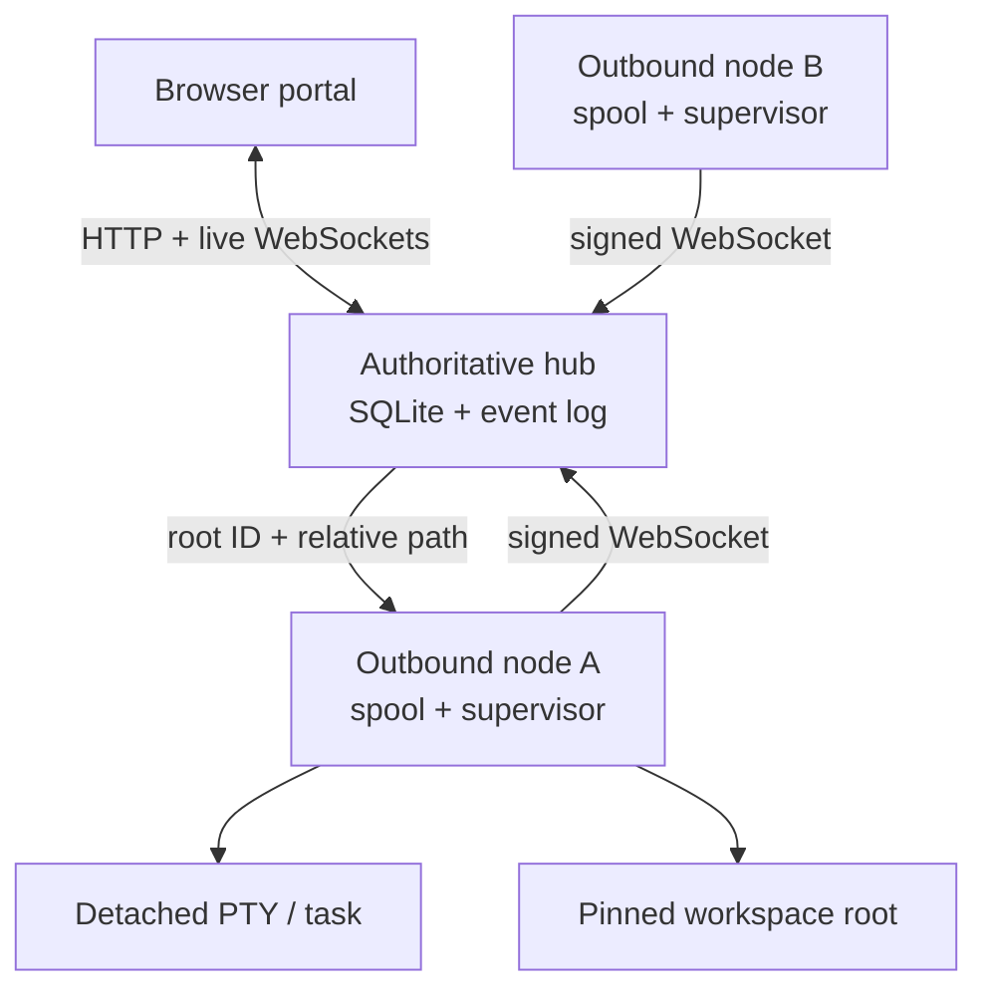

# WebSpider Fabric

WebSpider Fabric is a persistent research-portfolio orchestrator. One master Codex coordinates projects and durable worker Codex sessions across multiple machines: it can review every project's state, send detailed work to a project worker, receive progress and blocker reports, and follow up without requiring the user to supervise each terminal. The browser portal remains the user's control room and survives browser, hub, and worker reconnects.

WebSpider has two first-class interaction modes. For ordinary foreground work, open a project's persistent Sub-Spider and work with it directly. Engage the Master Spider when you want unattended management, delegation, follow-up, cross-project coordination, or an integrated portfolio result. Every primary agent is a real persistent Codex terminal; extra shell tabs provide screen-like monitoring for `nvidia-smi`, logs, and other tools without becoming orchestration message targets.

User distributions are versioned GitHub Release assets built on native GitHub-hosted runners. Each platform installer contains its own runtime; Node.js is an internal implementation detail, not a prerequisite the user installs or manages. Generated binaries are not committed to the source tree. The specification's final architecture calls for Go 1.24, `os.Root`, React, xterm.js, ACP, and tmux; current substitutions are tracked in [Implementation status](docs/IMPLEMENTATION_STATUS.md).

## Quick start

The release bootstrap detects the machine, downloads the matching immutable release asset from `MurrellGroup/WebSpider`, verifies it against `SHA256SUMS`, installs the native per-user boot service, and starts WebSpider:

```bash
i=$(mktemp);curl --http1.1 -fL --retry 5 -o "$i" https://github.com/MurrellGroup/WebSpider/releases/latest/download/WebSpider_Install.run&&sh "$i" --workspace "$PWD"
```

The same release also contains fully self-contained installers for direct or offline use:

| Machine | Release asset |
| --- | --- |
| Linux x86-64 | `WebSpider_Install_0.6.2_linux_x64.run` |
| Linux ARM64 | `WebSpider_Install_0.6.2_linux_arm64.run` |
| macOS Intel | `WebSpider_Install_0.6.2_macos_x64.run` |
| macOS Apple silicon | `WebSpider_Install_0.6.2_macos_arm64.run` |

The Hub's built-in local node keeps an authentication identity separate from any enrolled worker service on the same machine. Hub upgrades therefore do not displace a same-machine project worker, and both detached session stores remain recoverable.

Run the downloaded asset directly through the system shell:

```bash
sh ~/Downloads/WebSpider_Install_0.6.2_linux_x64.run --workspace /path/to/project
```

No separate runtime or package-manager setup is part of either user workflow.

### Codex-managed setup (Meta-Spider)

As an alternative, start Codex CLI in a directory dedicated to WebSpider maintenance and paste the following prompt. This creates an external, break-glass maintainer; it does not add another agent to the WebSpider portfolio.

```text
You are the Meta-Spider for WebSpider: a user-invoked, break-glass maintainer outside the WebSpider agent hierarchy. Work only inside the directory where I started you, except for per-user install/package-manager side effects needed to build or test WebSpider. Use https://github.com/MurrellGroup/WebSpider. Read every applicable AGENTS.md and docs/META_SPIDER.md before acting. Keep the source clone separate from any live WebSpider test-project directory. Set up or repair this machine as the WebSpider hub as I request, preserve durable state and user work, verify that only the intended WebSpider service is running, and install browser-test tooling locally when needed. You are not the Master Spider and do not perform ordinary portfolio/project work. Do not routinely prod or supervise WebSpider agents; reach into Master or Sub-Spider sessions only when I explicitly request diagnosis/repair or when bounded interaction is needed to validate that repair. Ask before sudo or expanding beyond this directory, and hand normal operation back to me and the intended WebSpider agents when maintenance is complete.
```

After installation, `webspider meta-spider prompt --workspace "$PWD"` prints the complete reusable role prompt. See [Meta-Spider maintenance role](docs/META_SPIDER.md).

Open `http://127.0.0.1:7340`. The **Master Spider** control opens its persistent terminal; **Portfolio** in that terminal's header opens the project overview. Closing the browser does not stop the managed agent or detached tasks.

### Remote server

On a trusted private network or VPN, bind the persistent service to the server's private address. A Tailscale address is preferable to `0.0.0.0` because WebSpider will then be reachable only through the tailnet:

```bash
i=$(mktemp);curl --http1.1 -fL --retry 5 -o "$i" https://github.com/MurrellGroup/WebSpider/releases/latest/download/WebSpider_Install.run&&sh "$i" --listen "$(tailscale ip -4):7340"
```

Open `http://<server-tailnet-name>:7340`, then enter the value printed by `webspider auth token`. Unauthenticated visitors can see the login screen and health status only; project data and control APIs require an authenticated session. Tailscale encrypts the connection end to end.

For an institutional VPN without end-to-end host encryption, put an HTTPS reverse proxy in front of WebSpider and install the service with `--public-base-url https://your-webspider-host.example.edu`. This marks browser session cookies as secure. Do not expose WebSpider over plain HTTP on the public internet.

For source development only, contributors can run the repository with Node.js 24:

```bash
node ./bin/webspider.js up --workspace .
```

`webspider up` starts the user's login shell. Run `codex` in the browser terminal. To launch Codex immediately instead, select it explicitly without defining a full agent profile:

```bash
node ./bin/webspider.js up --workspace . --agent-command codex
```

Run verification:

```bash
node --test --test-concurrency=1
node ./bin/webspider.js doctor
```

## Release engineering

The repository owns the build recipe; GitHub Releases own the binaries. `.github/workflows/ci-release.yml` tests and builds these native targets independently:

- `linux-x64` on `ubuntu-24.04`;
- `linux-arm64` on `ubuntu-24.04-arm`;
- `darwin-x64` on `macos-15-intel`;
- `darwin-arm64` on `macos-15`.

Pull requests, `main` pushes, and manual runs produce short-lived Actions artifacts after a clean-install smoke test. A semantic version tag such as `v0.6.2` additionally:

1. requires the tag to equal the version in `package.json`;
2. gathers exactly four native installers;
3. renders the platform-selecting `WebSpider_Install.run` bootstrap;
4. generates `SHA256SUMS`;
5. creates the matching GitHub Release and attaches those six files.

Create a release by pushing its annotated tag:

```bash
git tag -a v0.6.2 -m "WebSpider 0.6.2"
git push origin v0.6.2
```

For a native development build on the current machine:

```bash
npm run build:installer
```

That command writes a generated, Git-ignored platform installer under `dist/`. It refuses to label a runtime as a different OS or architecture.

## Add research projects

Open the portal and select **Add project**. Enter a project name and the worker machine name. WebSpider creates the portfolio record and displays one single-line command. Run that command once from the project directory on the machine that owns the files.

The command downloads the matching native installer, enrolls the machine with the project-bound one-time token, registers the current directory, installs a persistent per-user node service, and starts the project Codex. Node.js is not required. When the machine already runs a WebSpider node, the same command attaches the new project root to its existing signed identity and restarts that node service with all roots preserved. Installation now waits for the hub to authenticate the persistent node connection; it fails with the status and exact log command instead of claiming success while the node is offline.

After enrollment, the project and Sub-Spider appear in the portfolio automatically and are ready for direct user interaction. Closing the browser, restarting the hub, or rebooting the worker machine does not discard their durable identity or status. A Sub-Spider may report `working`, `blocked`, `completed`, or `idle`; reports update the portal without notifying the Master unless the Sub-Spider explicitly requests coordination.

When a project is finished, stop its agents and shell tabs and finish or cancel its active tasks, then select **Archive** on the project page. Archived projects leave the active portfolio but retain their WebSpider history and can be restored from **Archived**. Permanent deletion is available only from that archived view, requires typing the exact project name, and removes WebSpider's project records. It never deletes the project's workspace or user files. The Master Spider project cannot be archived or deleted.

The generated command has this shape and is intentionally one physical line:

```bash
i=$(mktemp);curl --http1.1 -fL --retry 5 -o "$i" https://github.com/MurrellGroup/WebSpider/releases/latest/download/WebSpider_Install.run&&sh "$i" --node 'https://hub.example' --token 'wsj_...' --workspace "$PWD" --name 'gpu-box'
```

The join token is stored hashed, expires after ten minutes, and is consumed atomically. The node generates an Ed25519 identity locally and thereafter authenticates outbound connections with signed, replay-bounded payloads. Worker machines require no inbound listener.

Inspect both the OS service and its most recent authenticated hub connection with one command on a worker:

```bash
webspider service status-node --state-dir "${XDG_DATA_HOME:-$HOME/.local/share}/webspider/node"
```

## Terminal input and notes

Terminal tabs open in **Direct** mode, where the browser keyboard talks straight to xterm and the PTY. On any primary Master or Sub-Spider terminal, **Text box** sends a durable WebSpider message directly to that selected agent; Enter sends and Shift+Enter inserts a newline. Unsent drafts are isolated per terminal and survive in-app navigation and page reloads in that browser tab. On auxiliary shell tabs the composer writes drafted text to the PTY, observing bracketed-paste mode only when the running program enables it.

**Notes** are small plaintext editors stored on the hub machine. Each note body is an actual mode-`0600` `.txt` file under `<hub-state-dir>/notes`; SQLite stores only its title, filename, timestamps, and visibility. New notes default to **Just for me**. A note is readable by the main agent only after the owner checks **Visible to Master**; workers cannot read either class of note, and the main agent has no note-write scope.

## Architecture



The hub owns projects, nodes, profiles, agent instances, threads, messages, deliveries, tasks, attempts, roots, terminal leases, artifacts, attention items, events, outbox records, sessions, and audit history. Nodes own host paths, process supervision, root-safe file opens, terminal logs, received-command deduplication, and unsent event spools.

## Operational behavior

- `webspider up` bootstraps a local project, primary agent, logical thread, terminal, workspace root, and default project agreement.
- Academic-project context is inferred from bounded workspace signals such as manuscript, bibliography, Quarto, LaTeX, notebook, results, and figure assets. When signals are sparse, the academic-first default remains usable without requiring answers.
- Every agent launch receives a versioned immutable, role-aware policy snapshot. Codex launches receive a managed `CODEX_HOME` that preserves existing user-level guidance and configuration while adding the compiled WebSpider instructions through native `AGENTS.md` discovery.
- Each agent page has an **Instructions** tab for concise, per-agent custom guidance. Save it for the next launch or save and restart immediately; revision conflicts are rejected and the active snapshot remains visible.
- **Sub-spider instructions** in the sidebar edits one compact worker-only instruction list inherited by every registered worker, never the Master. It can be saved for later launches or applied by restarting the currently running workers.
- Automatically managed Codex profiles run noninteractively with `approval_policy=never` and `sandbox_mode=danger-full-access`; this matches WebSpider's existing PTY host-user trust boundary and prevents an unavailable Linux user-namespace sandbox from turning durable work into an unattended approval loop. Explicit profile arguments always take precedence.
- The Master Spider is an on-demand durable multi-project manager. It becomes central when the user delegates unattended oversight, portfolio prioritization, bounded delegation, stalled-work follow-up, cross-project coordination, exception handling, or result integration. It does not relay or narrate routine direct Sub-Spider work.
- When a Sub-Spider is visibly waiting at a numbered Codex prompt, the Master can use `$WEBSPIDER_CONTROL agents choose --agent ID --option N` to send the bare choice digit without creating an inbound-message envelope; terminal leases prevent simultaneous browser input.
- Sub-Spiders are first-class user-facing project agents, not merely hidden executors. The user can message and steer each one directly. They receive project-specific instructions and a self-confined credential for durable status, detached commands in their own workspace, hooks to self or Master, and root-confined file transfer to an explicit Spider destination. They cannot list the portfolio, command peer execution, edit policy, or access owner APIs.
- Detached task completion can inject a durable user-role hook containing the task ID, custom completion text, and result into either the scheduling agent or the Master. One-shot or recurring future messages are persisted as reminder tasks, survive hub restarts and offline destinations, and can be listed or cancelled from the scoped helper.
- Detached work started directly by a Sub-Spider returns to that Sub-Spider by default; Master-delegated work returns to the Master. Either caller can explicitly select `self`, `master`, or `none`.
- Long text/Markdown instructions and results use durable document handoffs instead of terminal pastes. The destination node writes a checksum-verified mode-`0600` copy under the target workspace's reserved `.webspider/inbox/`, then injects a short message naming its document ID and local path. Offline delivery and matching retries are durable and idempotent; workers can hand documents back only to the Master.
- When the user explicitly asks to change behavior or defaults, the main agent can inspect and patch project- or system-level policy through its broader scoped helper. Revisions are optimistic and changes are audited. Harness-native child threads are explicitly de-scoped from the main-only agreement.
- The main agent treats session context and account allowance as different budgets. It uses `/status` at natural breakpoints for context and the reported weekly rate-limit percentage; `/usage weekly` is optional supporting token activity, never a substitute for percent remaining. Read-only observations are timestamped and shown in later inbound envelopes and the portal.
- Account management is always human-only. Agents cannot redeem token refreshes or rate-limit resets, buy/add/switch credits, change billing, plan, or authentication, move work to API-funded usage, or request entitlements—even if a provider surface happens to expose those actions.
- The portal defaults to the selected agent's live terminal. The login shell remains alive when the browser disconnects, and Codex runs inside it without a WebSpider conversation layer. Additional named shell tabs are independent processes for monitoring and ad hoc commands; only the primary agent process receives orchestration messages.
- Terminal input defaults to direct xterm control. The optional text-box composer supports mouse editing and lets large bracketed pastes settle before sending Enter.
- Pasting a PNG, JPEG, GIF, or WebP into a terminal stages it visibly; pressing Enter stores a private, checksum-verified copy under that agent workspace's `.webspider/uploads/` directory and sends the agent a durable message with the exact local path. Keyboard and context-menu paste use the same flow. Image uploads are capped at 8 MiB.
- **Attach file** stages up to four browser-selected files for the currently selected Master or Sub-Spider. Nothing uploads until Enter; each private, checksum-verified file is then written under that agent workspace's `.webspider/uploads/` directory and announced with its exact path. Files are capped at 8 MiB each.
- **Files → Upload files** puts browser-selected files directly into the folder currently open in the workspace browser. It does not create a message, wake an agent, or treat the file as an instruction. Uploads are chunked, resume from the node's confirmed offset after a transient failure, offer stop/keep-both/replace conflict handling, and allow files up to 64 GiB.
- Agents transfer large or binary files without SSH using `$WEBSPIDER_CONTROL files targets` and `files send --agent AGENT_ID --file PATH`. The Hub relays bounded checksum-verified chunks between two online nodes; only the completed mode-`0600` file and a short destination message are durable. Chunk bytes are not written to Hub or Node command databases. Small offline-safe text handoffs still use `documents send`.
- Worker status reports update durable portfolio state without messaging the Master by default. A worker explicitly opts into a Master notification only for delegated results, requested milestones, blockers, material risks, or decisions requiring coordination.
- Hub notes remain private plaintext files by default. Only notes explicitly marked visible enter the main agent's read-only allowlist; worker agents have no notes scope.
- Archived projects are excluded from the active portfolio and cannot receive new tasks, messages, agents, shells, or control tokens. Archive revokes existing project control tokens; permanent deletion is archived-only, exact-name confirmed, and deliberately leaves workspace files untouched.
- Conversations and Markdown-family files render sanitized Markdown and browser-native MathML. Terminal Maths mode preserves xterm's parsed transcript layout and uses a locally bundled MathJax only for recognized TeX equations. The primary Terminal view remains the byte-faithful ANSI/VT surface with direct keyboard input.
- Managed commands use an isolated native PTY bridge (`script` on Linux and `expect` on macOS), named input FIFO, detached process group, append-only terminal log, and atomic exit-status marker.
- Agent, shell, and detached-task processes inherit a narrow standard per-user environment (`HOME`, user identity, shell, locale, XDG runtime/data paths, and user bus when available) without copying arbitrary secrets. Persistent service PATHs always include the installation bin directory and `~/.local/bin`, so Codex remains discoverable after boot or an agent-driven per-user upgrade.
- A node restart reconciles persisted process IDs, log offsets, FIFOs, and exit markers. A hub outage does not terminate a detached process.
- Every node reconnect reports its reconciled runtime inventory. Previously-running agents missing after a machine reboot are restarted according to policy, receive a bounded copy of their prior terminal context, and get a durable recovery message instructing them to continue without requiring the user to restate the project.
- **Nodes → Update everything** coordinates an official-release update across the complete active fabric, including the Hub package and Master Spider. It sends every running spider a durable checkpoint request and waits for a separate update-ready acknowledgement; stale `working`/`completed` labels are never treated as approval. **Override / rescue** remains available while the rollout waits. The owner may auditably override missing acknowledgements and may explicitly stop each live detached command or allow it to survive the service restart. Offline machines cannot be overridden.
- The rollout is durable and inspectable: remote nodes install first, the Hub installs last, and node-reported versions are checked before proceeding. Official release bootstraps fetch platform assets with published SHA-256 verification. WebSpider then resumes every previously-running Codex session with `codex resume -C <registered-root> --last` (or its configured adopted-session selector). Cancelling is available until installation begins; a failed rollout attempts to resume stopped sessions before reporting failure.
- Browser event clients replay from a durable global sequence before receiving live events.
- Any number of terminal viewers may watch; only a valid, current lease holder can send input.
- Messages are accepted transactionally before dispatch and use immutable idempotency keys.
- File APIs accept only `(root_id, relative_path)`. Host paths never cross the browser API.
- Promoted artifacts are content-addressed by SHA-256 and remain independent of the workspace file.

## Security defaults

- Hub listens on `127.0.0.1` by default. Put Tailscale Serve or another trusted HTTPS proxy in front of it; do not expose it directly to the public internet.
- Browser authentication uses a Secure-capable, HttpOnly, SameSite session cookie; mutations require a separate CSRF token.
- WebSocket upgrades require an authenticated session and strict same-origin validation.
- Portal assets use a restrictive CSP and no third-party CDN code.
- Active project HTML, SVG, and JavaScript are download-only, never rendered as same-origin content.
- Roots pin their initial filesystem identity. Strict mode blocks all symlinks; contained mode verifies the opened target remains under the pinned root. Special files are never previewed or downloaded.
- Raw terminal bytes render only through xterm. Maths mode reads xterm's already-parsed text buffer into `textContent`, preserves its logical lines and whitespace, and then lets locally bundled MathJax replace recognized TeX delimiters; it never treats the transcript as HTML or Markdown. Terminal input remains size- and control-character-bounded.
- Audit records preserve the actual actor separately from the role delivered to an agent.
- Main-terminal control tokens are short-lived, revocable, and allowlisted to portfolio inspection, explicitly visible note reads, project/system policy edits, account-usage observations, agent discovery, provenance-preserving messages and document handoffs, detached command tasks on registered agent roots, and self-owned reminder hooks. Worker tokens are confined to self status, detached tasks in their own root, self-owned hooks delivered only to themselves or the Master, and document handoff only to the Master. Neither can authorize general project, note writes, general file writes, artifact, terminal, administrative, billing, reset, credit, authentication, or funding APIs.

See [Security model](docs/SECURITY.md) for details and limitations.

## Repository map

```text
bin/webspider.js             executable entry point
src/hub/                     HTTP API, auth, broker, event and runtime coordination
src/node/                    outbound daemon, rooted files, detached supervisor
src/db/                      hub and node SQLite schemas
src/transport/               bounded WebSocket implementation
src/lib/                     IDs, routing, HTTP, errors, cryptography
web/                         responsive browser portal and PWA manifest
test/                        persistence, security, runtime, and integration tests
docs/                        implementation and security notes
examples/                    API/configuration examples
install/                     single-file installer and installed-command launcher
scripts/                     native installer and release-bootstrap builders
.github/workflows/           native CI matrix and tag-to-Release publication
dist/                        generated local output (Git-ignored)
```

The completed cognitive-overhead audit and the product invariants it establishes are recorded in [User-burden audit](docs/USER_BURDEN_AUDIT.md). The main/worker authority split, sparse instruction compiler, and editable-default workflow are specified in [Behavior control and agent autonomy](docs/BEHAVIOR_CONTROL.md).

## Tailscale deployment

Keep the hub on loopback and publish it privately:

```bash
tailscale serve --bg http://127.0.0.1:7340
```

Set the advertised URL when starting the hub:

```bash
node ./bin/webspider.js hub \
  --listen 127.0.0.1:7340 \
  --public-base-url https://webspider.example-tailnet.ts.net
```

Tailscale reachability is not authorization: every browser session, WebSocket, root operation, terminal lease, and node command is still checked by WebSpider.
